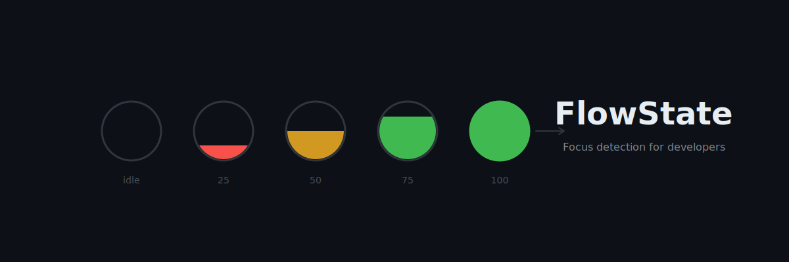

<p align="center">
  
</p>

<h1 align="center">FlowState</h1>

<p align="center">
  <strong>A smarter Pomodoro for developers who don't like timers</strong>
</p>

<p align="center">
  <a href="#features">Features</a> •
  <a href="#how-it-works">How It Works</a> •
  <a href="#installation">Installation</a> •
  <a href="#settings">Settings</a> •
  <a href="#tech-stack">Tech Stack</a>
</p>

---

## The Problem with Traditional Pomodoros

Traditional Pomodoro timers interrupt you at fixed intervals regardless of your actual focus state. You're in the zone, deep in solving a complex problem—and then *ding*, time for a break you don't need.

**FlowState is different.** It watches your actual keyboard and mouse activity, learns your work patterns, and only nudges you when you're genuinely losing focus. No arbitrary timers. No interruptions during flow.

## Features

- **Activity-Based Focus Detection** — Monitors keyboard and mouse activity to calculate a real-time focus score
- **Smart Screen Tint** — Gently desaturates your screen when focus drops, creating a subtle visual cue to take a break
- **ML-Powered Break Predictions** — Learns your optimal work rhythm and suggests breaks at the right moments
- **Liquid-Fill Menu Bar Icon** — Visualizes your current focus level with a smooth, filling indicator
- **Configurable Settings** — Fine-tune detection sensitivity, tint intensity, and break preferences
- **Privacy-First** — All processing happens on-device. No data leaves your Mac.

## How It Works

1. **Focus Score Engine** — Analyzes keyboard keystroke frequency and mouse movement patterns to generate a 0-100 focus score
2. **Idle Detection** — When your focus drops below a threshold for a sustained period, the screen gradually desaturates
3. **Session Tracking** — Tracks your work sessions and builds a model of your optimal focus duration
4. **Break Predictions** — Uses your historical patterns to predict when you'll benefit from a break, not when a timer says so

## Installation

### Requirements

- macOS 14.0 (Sonoma) or later
- Apple Silicon (M1/M2/M3/M4) or Intel Mac

### Build from Source

```bash
git clone https://github.com/salvadalba/nodaysidle-flowstate.git
cd nodaysidle-flowstate
swift build -c release
```

The built app will be in `.build/release/FlowState`.

### Grant Accessibility Permission

FlowState needs Accessibility access to monitor keyboard and mouse activity:

1. Open **System Settings → Privacy & Security → Accessibility**
2. Add FlowState to the list of allowed apps
3. Restart the app if needed

## Settings

Access settings via the menu bar dropdown → **Settings** button.

| Tab | Options |
|-----|---------|
| **Focus** | Idle threshold (20/30/40), Idle trigger duration (5-30s), Recovery time (3-10s) |
| **Tint** | Tint intensity (30-80%), Fade duration (10s-2min) |
| **Breaks** | Enable/disable smart break suggestions, Default session length (25-90min) |
| **General** | Launch at login, Version info |

## Menu Bar

The menu bar icon shows your current focus state:

- **Empty circle** — Low activity / idle
- **Filling circle** — Actively working, fill level = focus score
- **Pause icon** — Break suggestion triggered

Click the icon to see:
- Current focus score with color-coded progress bar
- Keyboard and mouse activity indicators
- Break suggestion (when active)
- Quick access to Settings and Quit

## Tech Stack

- **Swift 6** with strict concurrency
- **SwiftUI** for the settings interface
- **AppKit** for menu bar and screen overlay
- **Core Animation** for smooth tint transitions
- **Observation framework** for reactive state
- **On-device ML** for break prediction (no external APIs)

## Architecture

```
FlowState/
├── Models/
│   ├── ActivitySample.swift      # Data model for activity snapshots
│   └── UserPreferences.swift     # @AppStorage preferences
├── Services/
│   ├── ActivityMonitorService    # Keyboard/mouse monitoring
│   ├── FocusScoreEngine          # Focus calculation logic
│   ├── IdleDetector              # Idle state detection
│   ├── ScreenTintController      # Overlay management
│   ├── SessionTracker            # Session history
│   ├── BreakPredictor            # ML-based break suggestions
│   └── ActivityDataStore         # Persistence layer
├── Views/
│   ├── MenuBarDropdown           # Menu bar popup UI
│   ├── MenuBarIconRenderer       # Custom icon drawing
│   ├── ScreenTintOverlay         # Grayscale overlay window
│   └── SettingsView              # Settings tabs
├── AppState.swift                # Central state coordinator
└── FlowStateApp.swift            # App entry point
```

## Privacy

FlowState operates entirely on your device:

- Activity data is stored locally in `~/Library/Application Support/FlowState/`
- No network requests, no telemetry, no analytics
- Session history is used only for improving break predictions

## License

MIT License. See [LICENSE](LICENSE) for details.

---

<p align="center">
  <sub>Built for developers who value deep work.</sub>
</p>
